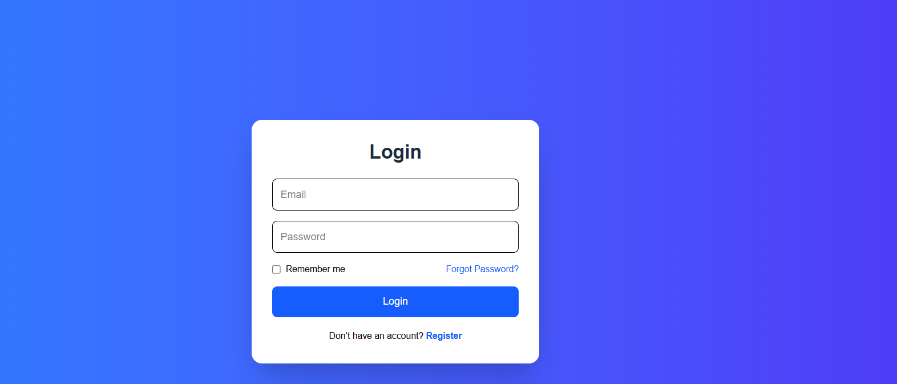
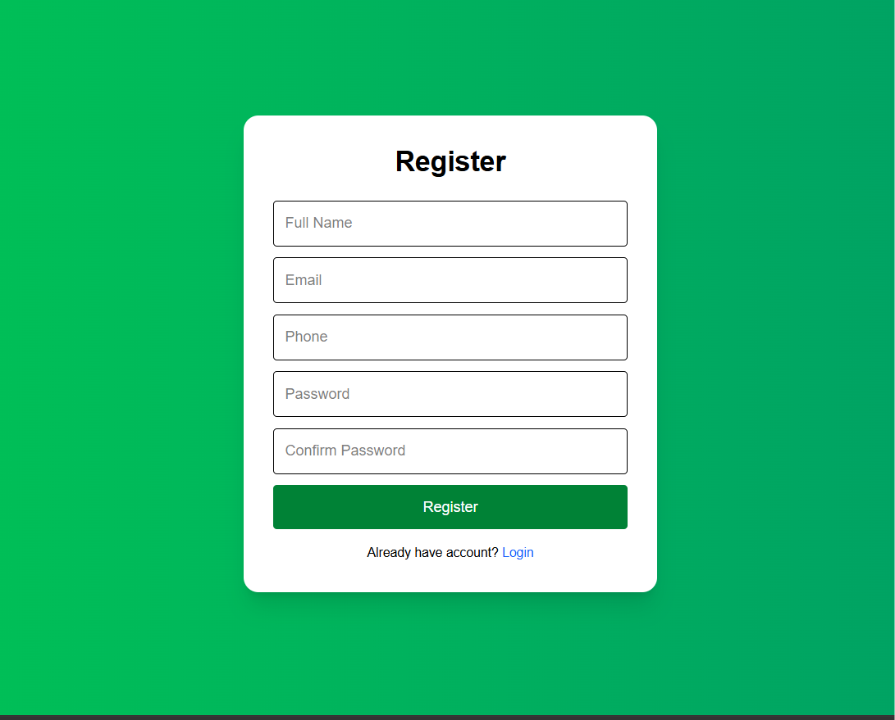
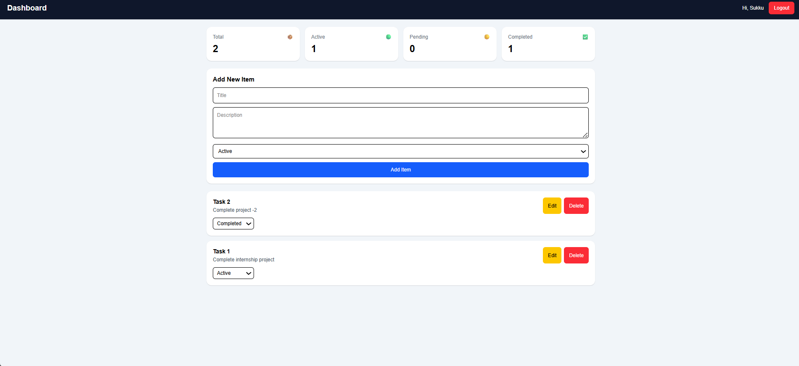
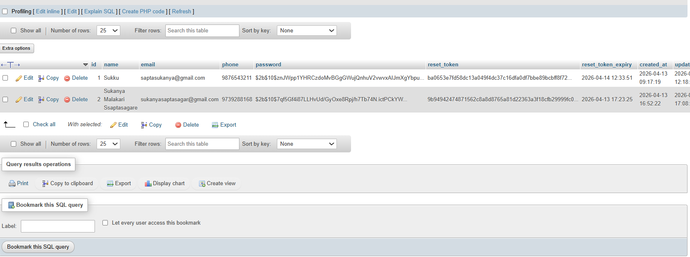
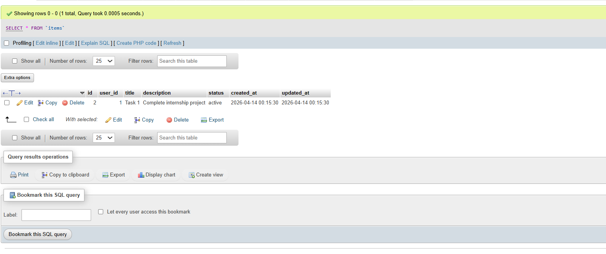

# MERN Auth CRUD with MySQL

## Features
- Register / Login / Logout
- Forgot Password via Email
- Reset Password
- Protected Dashboard
- CRUD Items Management
- Dashboard Statistics
- JWT Authentication

## Tech Stack
Frontend: React, Vite, Tailwind CSS, Axios
Backend: Node.js, Express.js
Database: MySQL

## Setup
### Backend
cd backend
npm install
npm run dev

### Frontend
cd frontend
npm install
npm run dev

## Environment Variables
PORT=5000
DB_HOST=localhost
DB_USER=root
DB_PASSWORD=
DB_NAME=mern_auth_db
JWT_SECRET=your_secret
JWT_EXPIRE=7d
EMAIL_USER=your_email
EMAIL_PASS=your_app_password

## API Routes
POST /api/auth/register
POST /api/auth/login
POST /api/auth/forgot-password
POST /api/auth/reset-password
GET /api/items
POST /api/items
PUT /api/items/:id
DELETE /api/items/:id

## Login Page

## Register Page

### Dashboard

## DashboardCrud

## Database

